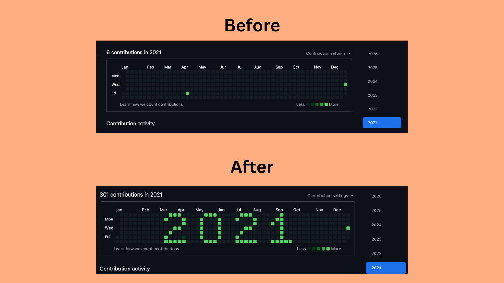

# 2021

The year, spelled out in pixel font right on the GitHub contribution graph for **2021**.

Each digit is a 5×7 glyph rendered as green squares — centered across the 52-week grid. 295 commits, one very legible year.

### See it live

Head to my [GitHub profile (2021 view)](https://github.com/aumvats?tab=overview&from=2021-12-01&to=2021-12-31) and scroll to the contribution graph.
